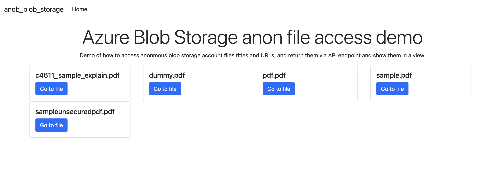

# anon-asp-net-azure-blob
Demo of an ASP.NET Core MVC application exposing Azure Blob Storage URLs and document titles via api endpoint and also surfacing files via ASP.NET Core MVC views.

Accessing all files via blob server-side is beneficial for many reasons, but allows provides the ability to retrieve all files from a blob container that can be set via environment variables, without knowing file names in said blob ahead of time.

